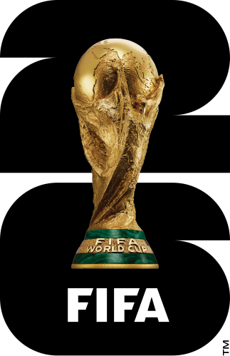

<!-- markdownlint-disable MD033 MD041 -->
<div align="center">
  

  <h1>Copa do Mundo FIFA 2026™ — Simulador Interativo</h1>

  <p>
    
    
    
    
    
  </p>

  <p>
    <strong>Simule todos os jogos da Copa do Mundo 2026 com cálculo de classificação em tempo real, chaveamento automático do mata-mata e dados completos das 48 seleções.</strong>
  </p>

  <p>
    <a href="#-sobre">Sobre</a> •
    <a href="#-funcionalidades">Funcionalidades</a> •
    <a href="#-stack-técnica">Stack</a> •
    <a href="#-arquitetura">Arquitetura</a> •
    <a href="#-como-executar">Executar</a> •
    <a href="#-contribuição">Contribuição</a>
  </p>
</div>

---

## 📖 Sobre

O **Simulador Copa do Mundo 2026** é uma aplicação web interativa e de código aberto para acompanhar e simular todos os jogos da **Copa do Mundo da FIFA 2026™** — o maior torneio da história, com **48 seleções** divididas em **12 grupos**, disputado nos Estados Unidos, México e Canadá entre 11 de junho e 19 de julho de 2026.

A aplicação calcula automaticamente classificações e progressão no chaveamento seguindo estritamente os **critérios oficiais de desempate da FIFA**, incluindo a regra de melhor terceiro colocado que classifica 8 das 12 terceiras posições.

Todo o progresso da simulação é salvo localmente no navegador via `localStorage` — sem necessidade de conta ou servidor.

---

## ✨ Funcionalidades

### ⚽ Fase de Grupos

- Insira placares em tempo real para todas as **48 partidas da fase de grupos**
- A tabela de classificação atualiza instantaneamente com os critérios oficiais da FIFA:
  - Pontos → Saldo de gols → Gols marcados → Confronto direto → Ranking FIFA
- Destaque visual diferenciado para: 1º classificado, 2º classificado, 3º disputado e eliminado
- Filtro por grupo com navegação entre rodadas (1ª, 2ª e 3ª rodada)
- Tabela global com os **8 melhores terceiros colocados** e seu status de classificação

### 🏆 Mata-Mata

- Chaveamento completo automaticamente populado a partir dos resultados da fase de grupos
- Suporte a todas as fases: **Round of 32 → Round of 16 → Quartas → Semis → 3º Lugar → Final**
- Campos de pênaltis desbloqueados automaticamente em caso de empate
- Propagação em cascata do vencedor para a próxima fase em tempo real
- Persistência independente do estado do chaveamento

### 🏟️ Estádios

- Galeria dos **16 estádios oficiais** em imagens WebP otimizadas
- Informações de capacidade, cidade, estado e país de cada sede

### 🧑‍⚖️ Árbitros

- Lista oficial dos árbitros por confederação (AFC · CAF · CONCACAF · CONMEBOL · OFC · UEFA)
- Accordion animado com logos oficiais das confederações
- Link direto para o perfil de cada árbitro no Transfermarkt

### 👥 Convocados

- Elencos completos das **48 seleções** organizados por posição (Goleiros · Defensores · Meio-campistas · Atacantes)
- **Numeração oficial (1 ao 26)** de todos os jogadores, atualizada com base nas convocações finais da FIFA
- Informação do técnico de cada seleção
- Link para o perfil de cada jogador no Transfermarkt
- Carrossel de navegação entre seleções com scroll suave

### ℹ️ Sobre o Torneio

- Página dedicada aos Mascotes Oficiais — **Maple** (Canadá), **Zayu** (México) e **Clutch** (EUA)
- Bola oficial **Adidas Trionda** com especificações técnicas completas

### 📺 Extras

- Countdown regressivo ao vivo para a abertura do torneio
- Indicação de emissoras de TV brasileiras por partida (TV Globo, SporTV, Globoplay, SBT, Cazé TV, NSports)
- Horários convertidos para o **Horário de Brasília (UTC-3)**
- Design responsivo com suporte a mobile

---

## 🛠️ Stack Técnica

| Camada | Tecnologia |
| --- | --- |
| Framework | [Vue 3](https://vuejs.org/) com `<script setup>` e Composition API |
| Linguagem | [TypeScript 6](https://www.typescriptlang.org/) (modo estrito) |
| Estado global | [Pinia 3](https://pinia.vuejs.org/) |
| Roteamento | [Vue Router 4](https://router.vuejs.org/) com lazy-loading por rota |
| Build | [Vite 8](https://vitejs.dev/) |
| Estilos | CSS Vanilla com variáveis customizadas (design system próprio) |
| Fontes | [Inter](https://fonts.google.com/specimen/Inter) via Google Fonts |
| Persistência | `localStorage` (sem backend) |
| Imagens | WebP otimizado via [sharp](https://sharp.pixelplumbing.com/) |

---

## 🗂️ Arquitetura

```text
src/
├── assets/
│   └── styles/
│       ├── main.css          # Estilos globais e componentes
│       └── variables.css     # Design tokens (cores, espaçamentos, tipografia)
├── components/
│   ├── ConfirmModal.vue      # Modal de confirmação reutilizável
│   ├── GroupTable.vue        # Tabela de classificação + jogos do grupo
│   ├── KnockoutMatch.vue     # Card de partida do mata-mata
│   ├── MatchCard.vue         # Card de partida da fase de grupos
│   ├── TeamBadge.vue         # Bandeira + nome da seleção
│   └── ThirdPlaceTable.vue   # Ranking dos melhores terceiros colocados
├── composables/
│   └── useBroadcasters.ts   # Lógica de emissoras de TV (reutilizável)
├── data/
│   ├── coaches.json          # Técnicos das 48 seleções
│   ├── knockoutRules.ts      # Template e regras do mata-mata
│   ├── matches.ts            # 48 partidas da fase de grupos com datas e sedes
│   ├── referees.ts           # Árbitros oficiais por confederação
│   ├── squads.json           # Elencos das 48 seleções (~300KB, chunk separado)
│   ├── teams.ts              # Seleções com grupo e ranking FIFA
│   ├── tournamentInfo.ts     # Dados dos mascotes e bola oficial
│   └── venues.ts             # 16 estádios com capacidade e imagem
├── router/
│   └── index.ts              # Rotas com lazy-loading por view
├── stores/
│   ├── knockoutStore.ts      # Estado e lógica do mata-mata (Pinia)
│   └── matchStore.ts         # Estado e classificações da fase de grupos (Pinia)
├── types/
│   └── index.ts              # Interfaces TypeScript (Team, Venue, GroupMatch…)
├── views/
│   ├── GroupsView.vue        # /grupos
│   ├── HomeView.vue          # /
│   ├── KnockoutView.vue      # /mata-mata
│   ├── RefereesView.vue      # /arbitros
│   ├── SquadsView.vue        # /convocados
│   ├── TournamentInfoView.vue # /sobre-torneio
│   └── VenuesView.vue        # /estadios
├── App.vue                   # Layout raiz com navbar
└── main.ts                   # Bootstrap da aplicação
```

---

## 🚀 Como Executar

### Pré-requisitos

- [Node.js](https://nodejs.org/) **v18+**
- [npm](https://www.npmjs.com/) v9+ (incluído no Node.js)

### Instalação

```bash
# 1. Clone o repositório
git clone https://github.com/caiquenovaes1994/WorldCup2026.git
cd WorldCup2026

# 2. Instale as dependências
npm install

# 3. Inicie o servidor de desenvolvimento
npm run dev
```

Acesse **[http://localhost:5173](http://localhost:5173)** no navegador.

### Scripts disponíveis

| Comando | Descrição |
| --- | --- |
| `npm run dev` | Inicia o servidor de desenvolvimento com HMR |
| `npm run build` | Compila TypeScript e gera o bundle de produção em `dist/` |
| `npm run preview` | Serve o bundle de produção localmente para validação |

> **Windows**: use `iniciar_worldcup.bat` para iniciar o servidor com um duplo clique.

---

## 📁 Estrutura de Rotas

| Rota | View | Descrição |
| --- | --- | --- |
| `/` | `HomeView` | Página inicial com countdown e visão geral dos grupos |
| `/grupos` | `GroupsView` | Fase de grupos com placares e classificações |
| `/mata-mata` | `KnockoutView` | Chaveamento completo do mata-mata |
| `/estadios` | `VenuesView` | Galeria dos 16 estádios oficiais |
| `/arbitros` | `RefereesView` | Lista dos árbitros por confederação |
| `/convocados` | `SquadsView` | Elencos das 48 seleções |
| `/sobre-torneio` | `TournamentInfoView` | Mascotes e bola oficial |

---

## 🤝 Contribuição

Contribuições são bem-vindas! Antes de abrir um *Pull Request*, leia:

- [**Código de Conduta**](CODE_OF_CONDUCT.md) — padrão de comportamento esperado
- [**Política de Segurança**](SECURITY.md) — como reportar vulnerabilidades

### Como contribuir

```bash
# 1. Faça um fork do repositório
# 2. Crie uma branch descritiva
git checkout -b feat/nome-da-funcionalidade

# 3. Faça suas alterações e commit
git commit -m "feat: descrição clara da mudança"

# 4. Abra um Pull Request contra a branch main
```

---

## 📄 Licença

Distribuído sob a licença **MIT**. Consulte o arquivo [LICENSE](LICENSE) para mais detalhes.

---

<div align="center">

Desenvolvido por **[Caique Novaes](https://github.com/caiquenovaes1994)**

<a href="https://github.com/caiquenovaes1994">
  
</a>
<a href="mailto:caiquenovaes1994@gmail.com">
  
</a>

</div>
